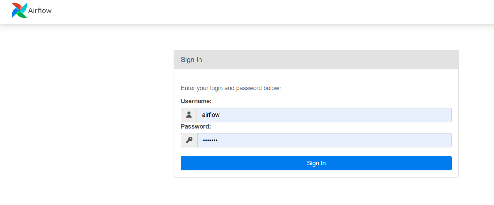
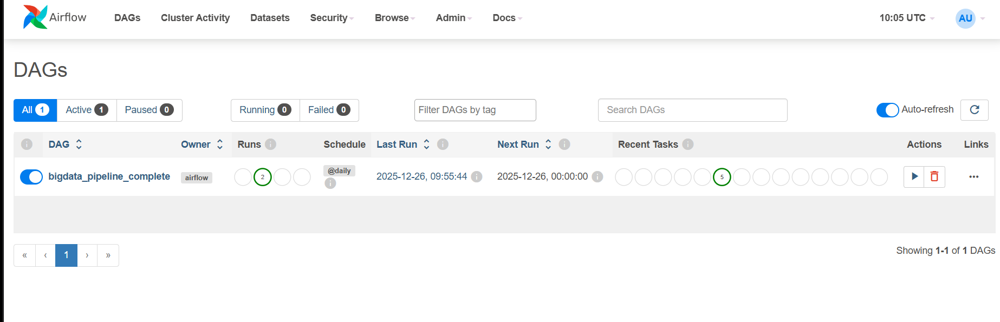
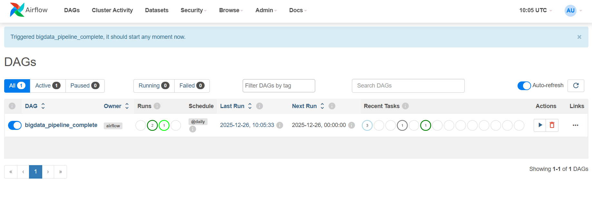
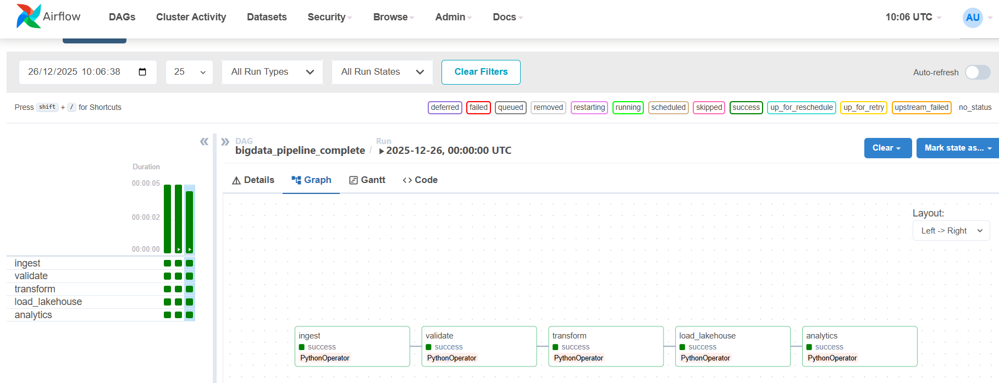
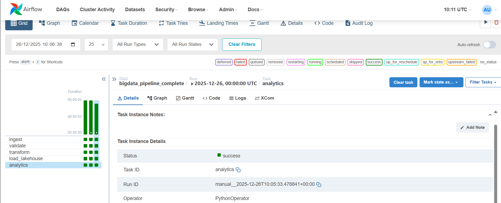
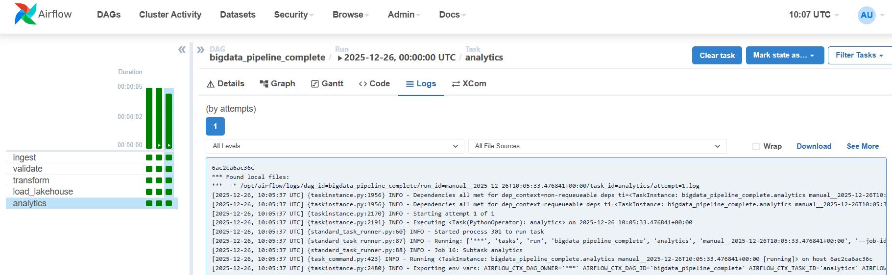

# Pipeline Big Data avec Apache Airflow

Un pipeline Big Data simple orchestré avec Apache Airflow, de l'ingestion des données à l'analyse.

## Architecture du Pipeline

```
Sources → Ingestion → Data Lake (BRUT) → Traitement → Lakehouse (CURATED) → Analyse
```

- **Data Lake (BRUT)**: Stockage des données brutes
- **Traitement**: Nettoyage et structuration des données
- **Data Lakehouse (CURATED)**: Données prêtes pour l'analyse
- **Airflow**: Orchestration et surveillance

## Interface Web Airflow

**URL**: `http://localhost:8080`
**Connexion**: airflow / airflow



## Exécution via l'Interface Airflow

### 1. Activation du DAG



### 2. Déclenchement Manuel



### 3. Vue Graphique

Visualisez les dépendances des tâches et le flux d'exécution.



### 4. Surveillance de l'Exécution

- Vert : Succès
- Rouge : Échec
- Bleu : En cours



### 5. Inspection des Logs

Consultez les logs détaillés pour chaque tâche.



## Conclusion

Cet atelier démontre comment construire un pipeline Big Data simple, orchestrer les étapes avec Apache Airflow, surveiller l'exécution via une interface web, et vérifier les résultats dans le Data Lake et le Data Lakehouse. Il fournit une fondation idéale avant de passer à des pipelines Big Data avancés avec Spark, Hadoop et des outils BI.
